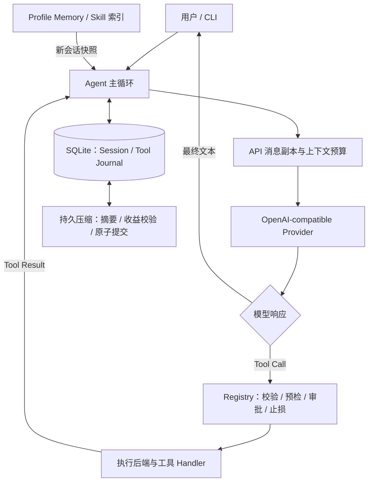

<div align="center">

# Mini Harness

**从模型调用到可靠执行，动手实践 Harness Engineering。**

一个受 Hermes Agent 启发的轻量级 Python Agent 运行框架。

`Agent Loop` · `Memory` · `Context Compression` · `Skills` · `Tool Calling` · `Recovery`

[快速开始](#快速开始) · [架构概览](#架构概览) · [工程设计](#工程设计) · [测试与验证](#测试与验证) · [学习文档](#学习文档)

</div>

---

## 为什么做这个项目

模型决定下一步做什么，Harness 负责让这一步被正确执行：哪些工具可以调用、参数是否有效、是否需要审批、结果怎样交回模型，以及失败后如何保留现场并恢复。

Mini Harness 将这些机制拆成可阅读、可运行、可测试的模块，适合学习 Agent 工程、研究故障边界，以及复盘实际开发问题。

项目参考了 **Hermes Agent 的架构与工程实践**，结合轻量级架构独立实现；运行时不依赖 Hermes 源码。目前定位于单机、CLI、文本与文件任务。

## 核心能力

| 能力 | 实现重点 |
| --- | --- |
| Agent Loop | 模型响应 → 工具执行 → 结果回传；调用预算与一次无工具收尾 |
| 工具系统 | Registry、JSON Schema、路径预检、人工审批、子进程执行 |
| 持久记忆 | Profile 下的 `USER.md` / `MEMORY.md`；跨进程锁与原子更新 |
| 上下文管理 | 请求副本裁剪与持久语义压缩；首尾保护、收益检查、事务提交 |
| Skill | 启动时加载轻量索引，显式调用时完整读取 `SKILL.md` |
| 会话恢复 | SQLite 消息历史与 Tool Journal；区分未执行和结果未知 |
| 可观察性 | JSONL 结构化事件与 SQLite 审计，追踪执行和压缩状态 |

**技术栈：** Python 3.10+ · SQLite · OpenAI-compatible Chat Completions · JSON Schema · Multiprocessing · PyYAML

## 架构概览



Provider 处理模型接口细节；Agent 编排流程；Registry 决定工具是否允许执行；Handler 完成实际工作。

## 快速开始

以下命令在项目根目录执行。主要验证环境为 Windows / PowerShell。

### 1. 安装

```powershell
git clone https://github.com/todaysunnyOvO/mini-harness.git
cd mini-harness
python -m venv .venv
.\.venv\Scripts\python -m pip install -e .
Copy-Item .env.example .env
```

### 2. 配置模型

在 `.env` 中填写凭据：

```dotenv
MINI_HARNESS_API_KEY=你的API密钥
```

在 [config.yaml](config.yaml) 中设置服务地址和模型名称。仓库当前配置为：

```yaml
provider:
  base_url: https://api.deepseek.com
  model: deepseek-v4-pro
  api_key_env: MINI_HARNESS_API_KEY
```

可替换为所使用的 OpenAI-compatible 服务；不同服务的协议细节仍需验证。凭据放在 `.env` 或环境变量中，行为设置放在 YAML 中。

### 3. 运行

```powershell
# 检查配置，不发送模型请求
.\.venv\Scripts\python -m mini_harness --check-config

# 交互式对话
.\.venv\Scripts\python -m mini_harness

# 单次任务
.\.venv\Scripts\python -m mini_harness --message "读取 README.md，概括这个项目的核心能力"
```

默认文件工具受 `agent.workspace_root` 限制。`write_file` 和 `memory_update` 每次执行前需要人工批准。

<details>
<summary>Linux / macOS 安装与运行方式</summary>

```bash
python3 -m venv .venv
.venv/bin/python -m pip install -e .
cp .env.example .env
# 填写 .env 和 config.yaml 后运行
.venv/bin/python -m mini_harness --check-config
.venv/bin/python -m mini_harness
```

其他平台的行为以实际测试为准，尤其是进程启动、文件锁和路径处理。

</details>

## 常用操作

安装后可用虚拟环境中的 `mini-harness` 命令，或继续使用 `python -m mini_harness`。

| 任务 | 参数 / 交互命令 |
| --- | --- |
| 创建或继续指定会话 | `--session demo --message "读取 README.md"` |
| 严格恢复已有会话 | `--resume demo --message "继续讨论刚才的内容"` |
| 列出当前 Profile 会话 | `--list-sessions` |
| 查看 Skill 索引 | `--list-skills` 或 `/skills` |
| 加载 Skill 执行任务 | `--skill harness-review --message "审查这个项目"` |
| 交互调用 Skill | `/skill harness-review 审查这个项目` |
| 查看持久压缩状态 | `/context` |
| 手动压缩已有会话 | `--resume demo --compress "保留关键决策和未解决问题"` |
| 交互压缩 | `/compress 保留关键决策和未解决问题` |

`--session` 可以创建新会话；`--resume` 要求会话已经存在。普通聊天历史属于单个 Session，跨会话长期事实需要通过 Memory 显式保存。

## 工程设计

### 四层兜底：预防 → 纠错 → 止损 → 恢复

| 层次 | 关键机制 | 保护的边界 |
| --- | --- | --- |
| 预防 | 工具注册、Schema 校验、路径预检、写操作审批 | 在 Handler 启动前拒绝非法或未授权操作 |
| 纠错 | 已注册集合内的保守名称修复、结构化错误回传 | 允许模型根据真实错误调整下一步 |
| 止损 | 相同调用限制、批次与轮次预算、进程超时终止 | 控制重复执行与失控循环 |
| 恢复 | 持久化 Journal、协议修复、未知结果标记 | 保留事实，避免重复执行非幂等操作 |

工具执行默认使用 Spawn 子进程。超时终止只证明该隔离进程停止，不能证明此前没有副作用；写工具在结果丢失时仍标记为 `unknown`。

恢复会检查 Journal：`prepared` 且缺少结果表示 Handler 尚未获准启动；`running` 且缺少结果表示结果未知。两种状态都不会触发工具自动重放。详见 [四层故障矩阵](docs/FAULT_MATRIX.md)。

### Memory：持久化事实，冻结会话快照

```text
.mini-harness/profiles/<profile.id>/memory/
├── USER.md      # 稳定偏好
└── MEMORY.md    # 长期事实与环境信息
```

新 Session 将 Memory 快照冻结进 System Prompt。当前会话更新 Memory 后，新状态通过 Tool Result 告知模型；已有 System Prompt 保持不变，未来新会话读取新快照。这使记忆更新尽量保留稳定的请求前缀，有利于服务端 Prompt Cache 复用。

Memory 更新使用操作系统文件锁、同目录临时文件和原子替换。进程退出后由操作系统释放锁，避免仅凭文件时间猜测锁是否失效。

### Context：临时裁剪与持久压缩分工

| | API 请求副本裁剪 | 持久语义压缩 |
| --- | --- | --- |
| 目的 | 让当前请求适配输入预算 | 为长期会话生成可复用摘要 |
| 操作对象 | 临时 `api_messages` | SQLite 活动历史 |
| 主要机制 | 旧结果缩减、重复结果回指、完整轮次裁剪 | 中间轮次摘要、滚动合并、软归档 |
| 数据边界 | 不回写长期历史 | 收益检查通过后在单个事务中提交 |

两层机制都保护必要的最近轮次和未知工具结果。持久压缩还保留最早轮次；摘要失败、收益不足或事务失败时，原活动历史不会被替换。

推理模型的摘要长度采用 Prompt 目标，避免小额 API 硬输出上限被 reasoning 耗尽。完整正文返回后再检查收益，过长摘要会被拒绝，而不会通过静默截断制造成功。

### Skill：轻量发现，完整加载

启动时扫描名称、描述和来源；用户显式选择后完整加载 `SKILL.md`，作为当前轮 User 消息注入。Skill 正文不会常驻 System Prompt，也没有分页读取接口。

来源优先级为：Profile 本地 → 配置的外部目录 → 捆绑目录 → 显式启用的可选目录。当前通过 CLI 调用 Skill，尚未提供模型自主加载工具。

## 测试与验证

```powershell
.\.venv\Scripts\python -m unittest discover -s tests -v
```

截至 **2026-09-04**，自动化回归为 **146 项通过**。测试覆盖工具协议、审批、上下文预算、压缩事务、进程超时、记忆锁和恢复状态等机制。

另有真实 DeepSeek API、临时 SQLite、实际子进程和本地 HTTP 服务的场景验证。例如，推理模型兼容性修复后的一个长会话样本由约 **22,846 → 13,272 tokens**，成功提交持久摘要。

这里的 token 数来自字符比例估算，单次样本不代表稳定压缩率。默认自动化套件包含 Fake / Mock Provider，执行测试命令不等于完成真实模型质量评估。复现过程、失败证据和修复记录见 [真实问题记录](docs/真实问题.md)。

## 当前边界

- 单机 CLI 教学项目，尚未提供分布式调度、多用户服务或多 Provider 自动路由。
- Profile 是应用级状态划分；底层 Session 读取接口仍需进一步收紧，不能视作多租户安全边界。
- Skill 的 `SKILL.md` 可完整加载，但 `skill://` 附属资源路径尚未接入文件工具解析。
- Provider 支持有限退避重试，目前尚未按服务端 `Retry-After` 指定时间等待。
- 显式选择线程执行后端时无法强杀 Handler；需要硬期限的工具应使用默认进程后端。

## 代码导航

```text
src/mini_harness/
├── agent.py                 # Agent 主循环与调用预算
├── provider.py              # 模型传输与响应解析
├── tools/                   # 注册、校验、审批与文件 / Memory 工具
├── execution.py             # 进程与线程执行后端
├── memory.py                # Profile 长期记忆
├── skills.py                # Skill 发现与完整加载
├── api_messages.py          # 请求副本与消息协议处理
├── context_budget.py        # 输入预算
├── context_pruning.py       # 工具结果与历史裁剪
├── context_compression.py   # 持久摘要与压缩编排
├── session_store.py         # Session、Journal、迁移与恢复
└── events.py                # 结构化事件
```

## 学习文档

| 想了解什么 | 从这里开始 |
| --- | --- |
| 与 Hermes 的关系和设计取舍 | [Mini Harness 与 Hermes 对照](docs/HERMES_COMPARISON.md) |
| 四层兜底怎样验证 | [故障矩阵](docs/FAULT_MATRIX.md) |
| 开发中真实遇到的问题 | [真实问题与修复证据](docs/真实问题.md) |
| 长期维护的工程经验 | [开发实际问题与解决方案](docs/DEVELOPMENT_PROBLEMS_AND_SOLUTIONS.md) |
| 上下文压缩的演进 | [开发方案](docs/CONTEXT_COMPRESSION_V2_PLAN.md) · [开发进度](docs/CONTEXT_COMPRESSION_V2_PROGRESS.md) |
| 项目规划与阶段记录 | [初始计划](docs/PLAN.md) · [执行进度](docs/PROGRESS.md) |
| 后续开发方向 | [开发路线](docs/NEXT_DEVELOPMENT_PLAN.md) · [开发进度](docs/NEXT_DEVELOPMENT_PROGRESS.md) |

## 致谢

感谢 [Nous Research / Hermes Agent](https://github.com/NousResearch/hermes-agent) 提供的开源工程实践。Mini Harness 通过研究、实现和真实故障复盘，探索如何让模型驱动的 Agent 更可控、更容易理解。
